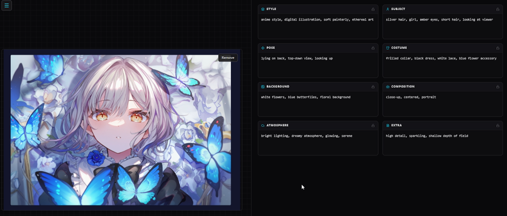
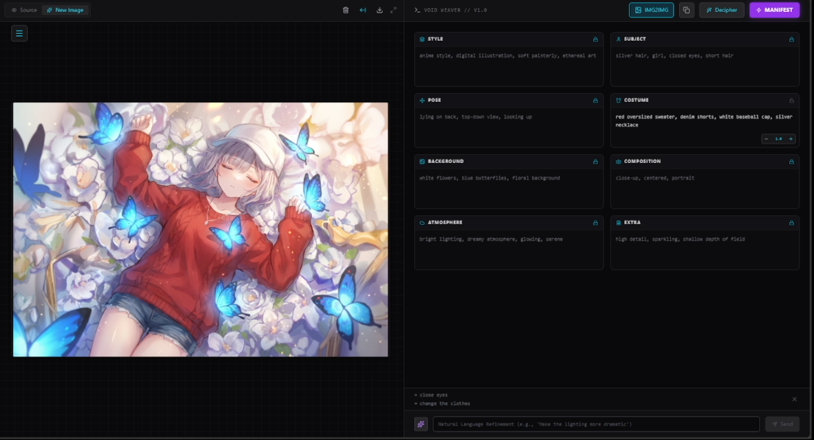
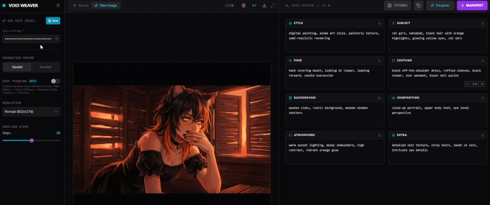
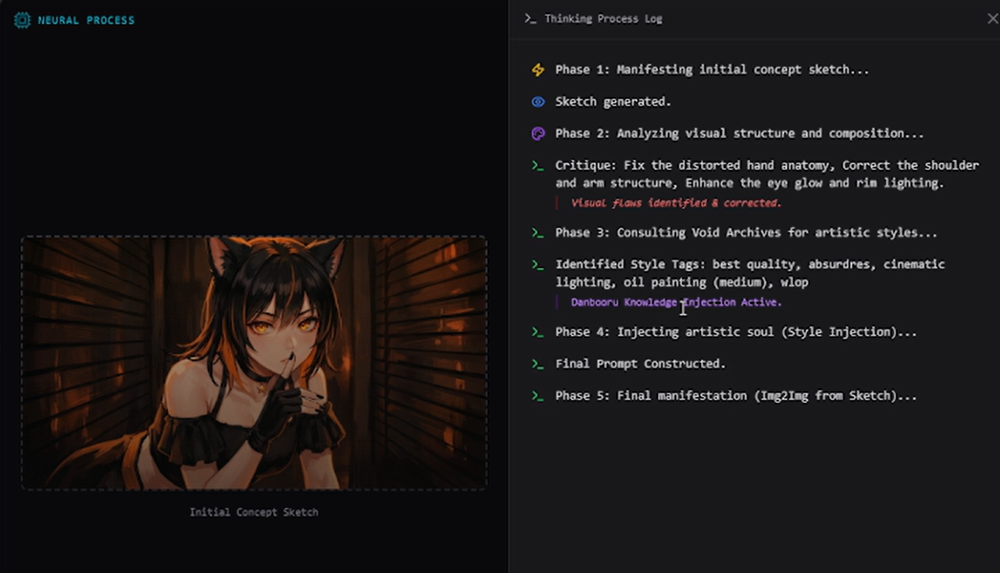

<div align="center">
  <h1>Void Weaver</h1>
  <p><b>Turn images into editable creative structures, then weave new visual worlds.</b></p>
  <a href="../LICENSE"></a>
  
  
  
</div>
<br/>

> Rewrite the World Protocol Active

[中文](README_CN.md) | [日本語](../README.md)

<div align="center">
  
  <p><b>Gemini Hackathon entry</b></p>
</div>

<br/>

<div align="center">
  
  <p><b>Homepage preview</b></p>
</div>

## Why

AI image generation tools are everywhere now, but many of them still compress the creative process into a single prompt: you type text, the model returns an image, and the structure in between is hard to see or control.

Void Weaver focuses on a different problem: **how to turn a reference image into a creative structure that can be edited, locked, weighted, and iterated.**

It reads a reference image and decomposes the visual information into modules such as style, subject, pose, costume, background, composition, and atmosphere. Users can edit those modules like layers: strengthen a tag, remove an unwanted detail, lock the character pose, change only the background, or tell the AI what to change next in natural language.

Void Weaver is not a one-way tool where you enter a prompt and wait for an output. It is closer to an AI image creation console: decipher reality first, then rewrite it.

## Usage

### 1. Configure the generation environment

Enter your Gemini API Key in the left settings sidebar and choose a generation engine. NovelAI is well suited for anime and stylized generation, while Google Imagen is better for realistic and broader creative outputs.

### 2. Upload an image

Drag an image into the Source Material area. It becomes the source for analysis, image-to-image generation, and style extraction.

### 3. Analyze the image

Click DECIPHER. The system calls Gemini to analyze the image and generate structured modules, such as costume, background, and pose. The parsed result can be refined further.

<div align="center">
  
</div>

### 4. Edit modules

You can continue adjusting the parsed modules:

- Remove unnecessary tags
- Strengthen or weaken tag weights
- Lock modules you do not want to change
- Manually add new visual descriptions

### 5. Image-to-image generation

Enter a natural-language instruction at the bottom, for example:

```text
Change the clothes to a red sweater, make the eyes closed as if sleeping, and use a 45-degree half-body view.
```

Void Weaver updates only the modules that are allowed to change based on the lock state.

Click MANIFEST. The system assembles the current modules into the final prompt and calls the selected engine to generate a new image.

<div align="center">
  
</div>

### 6. Direct image generation

In addition to image-to-image generation, you can mix multiple images or generate directly from your own idea. Before generation, you can customize canvas size, generation steps, model type, and related parameters.

<div align="center">
  
</div>

### 7. Deep Thinking

Deep Thinking starts from a structural sketch and performs visual review through the generation process, making the final output more stable and polished while keeping the process visible.

<div align="center">
  
</div>

## Workflow

```text
Source Image
  -> Decipher
  -> Prompt Modules
  -> Lock / Weight / Refine
  -> Manifest
  -> New World
```

## Features

| Feature | When | What it does |
| :--- | :--- | :--- |
| Image analysis | You have a reference image and want to extract its visual structure | Uses Gemini to decompose the image into editable modules |
| Modular prompt editing | The prompt is too long, messy, or hard to maintain | Splits the prompt into modules such as Style, Subject, Pose, Costume, and Background |
| Tag weights | You want some visual elements to be stronger or weaker | Sets weights for individual tags to influence generation |
| Module locking | You want to change only part of the image without damaging the subject | Locks specific modules and lets AI modify only the unlocked parts |
| Natural-language refinement | You want to adjust the image with one sentence | Uses instructions to rewrite related modules |
| Dual generation engines | You need different generation styles | Supports NovelAI and Google Imagen workflows |
| Deep Thinking | You want stronger self-checking before generation | Creates a sketch, performs visual critique, outputs correction commands, then generates the final image |
| History and replay | You want to compare different results | Keeps generation history and displays Deep Thinking logs |

## Technical Design

Void Weaver uses a separated frontend and backend architecture:

| Layer | Technology | Description |
| :--- | :--- | :--- |
| Frontend | React 18 / TypeScript / Vite | Builds the interactive creation workstation |
| State management | Zustand | Manages images, modules, generation history, and UI state |
| Styling | TailwindCSS | Builds the dark, modular, console-like interface |
| Backend | Spring Boot 3.2.1 | Provides image analysis, refinement, and generation APIs |
| AI analysis | Gemini | Converts images into structured modules |
| AI generation | NovelAI / Google Imagen | Generates images from the final prompt |

## Requirements

- Java 17+
- Node.js 18+
- Maven 3.8+
- Gemini API Key
- NovelAI API Token, optional
- Google Cloud Credentials, optional

## License

MIT License. Feel free to use, modify, and build on Void Weaver.
